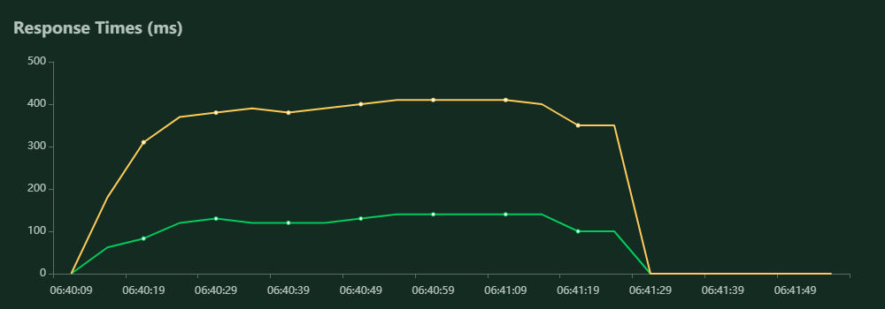

## Exercice 4

Dans l'exercice 4, nous avons utilisé FastAPI pour développer la même API que le modèle précédent.
Toute l'API est documentée dans la route /docs du service avec des exemples d'utilisation appropriés.

Comme pour tout service productif, des tests de performance sont effectués. En utilisant Locust, on peut générer des rapports sur le débit du service et le temps de réponse moyen en fonction de la charge utilisateur.

Pour ces tests, nous essayons de classer une phrase plusieurs fois, et de vérifier comment notre service se comporte.

### Requêtes Echouées

La première chose intéressante à analyser à partir de nos tests de performance est la suivante : notre service échoue-t-il à un moment donné ? D'après le criquet, sur 33345 demandes en une minute, le service n'a eu que des réponses OK (200), et aucun échec, ce qui signifie que notre service peut tenir le coup pendant une période de stress.

### Temps de réponse

La prochaine chose à analyser est le temps de réponse moyen. En raison de la nature du fonctionnement de l'API Rest, nous ne classifions généralement qu'une seule phrase à la fois, et nous ne pouvons donc pas utiliser la prédiction de "batch" (bien que pour un service productif, cela puisse être une possibilité d'accélération). Comme nous devons classifier chaque phrase individuellement, nous perdons la force de ML qui consiste à faire du traitement parallèle et des GPU (si nous voulons du traitement parallèle, nous devons faire un _horizontal scaling_ ce dont nous parlons à la fin de cette section) et donc, même si les temps de réponse ne sont pas très importants, ils sont très acceptables pour un service ML, comme le montre le graphique ci-dessous :

Dans le graphique ci-dessus, la ligne verte représente le temps de réponse moyen pour le 95% percentile et la ligne verte représente la médiane. Il est important de noter que Locust commence avec moins d'utilisateurs et augmente linéairement la charge sur le service.

En moyenne, notre service prend environ 161 ms pour répondre avec la distribution de probabilité des classes d'une phrase. Nous pouvons clairement constater que même si notre temps de réponse devient plus lent à mesure que de plus en plus d'utilisateurs se connectent, nous pouvons toujours gérer la quantité de requêtes. 

### Améliorations Possibles

Pour améliorer les performances à l'avenir, peu d'idées pourraient être envisagées :

- _Vertical Scaling_ : L'ajout de mémoire devrait améliorer légèrement le service, mais il finira par se stabiliser. D'abord parce qu'à un moment donné, plus de mémoire (ajoutée verticalement) ne serait pas utile, simplement parce que nous ne classons qu'une phrase à la fois et que notre modèle est occupé. D'autre part, l'empilage de plus de CPU pourrait être très utile si cette ressource est utilisée correctement (en exécutant chaque classification dans un CPU différent).

- Une technologie WSGI/ASGI telle que Ngnix pourrait être utilisée pour optimiser davantage les ressources. Par exemple, l'utilisation d'un système de cache pour les requêtes améliorerait probablement beaucoup notre exemple, étant donné que nous utilisons toujours la même phrase test.

- _Horizontal Scaling_: Après avoir ajouté un WSGI/ASGI, nous pourrions l'utiliser comme _load balancer_ et déployer plusieurs instances de notre service en fonction de la charge actuelle. De cette façon, nous pouvons augmenter notre service presque indéfiniment en fonction de la charge actuelle et en étant limités par la limite de l'_load balancer_ (qui devrait être très élevée).